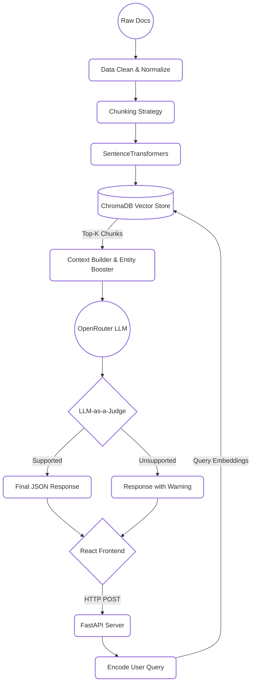

<div align="center">

<picture>
  <source media="(prefers-color-scheme: dark)" srcset="https://readme-typing-svg.demolab.com?font=Inter&weight=800&size=36&pause=1000&color=A9BFAE&center=true&vCenter=true&width=800&lines=RAG-Powered+Knowledge+Engine;Entity+Boosting+%2B+LLM-as-a-Judge;Production-Ready+FastAPI+%2B+React;Semantic+Search+%2B+ChromaDB">
  <source media="(prefers-color-scheme: light)" srcset="https://readme-typing-svg.demolab.com?font=Inter&weight=800&size=36&pause=1000&color=1C261D&center=true&vCenter=true&width=800&lines=RAG-Powered+Knowledge+Engine;Entity+Boosting+%2B+LLM-as-a-Judge;Production-Ready+FastAPI+%2B+React;Semantic+Search+%2B+ChromaDB">
  
</picture>

<br/>

**A comprehensive, production-ready Retrieval-Augmented Generation (RAG) system built over a 12-week AI/ML engineering pipeline. This system ingests, cleans, chunks, and embeds documents into a vector database, exposing a fully-featured FastAPI backend and a sleek, custom claymorphism React frontend.**

<br/>

<p align="center">
  
  
  
  
  
</p>

</div>

---

## 🚀 Project Overview

This repository contains `ragkit`—a highly modular RAG framework. It goes beyond simple semantic search by implementing advanced NLP techniques designed for scale and precision:

- 🎯 **Entity Boosting**: Aggressively prioritizes chunks mentioning specific entities, ensuring exact keyword matches don't get lost in semantic space.
- ⚖️ **LLM-as-a-Judge**: Automatically verifies generated answers against the retrieved context to flag potential hallucinations *before* the user trusts them.
- 📊 **Dynamic Topic Modeling**: Allows clustering and filtering by topic across the vector store.
- 📡 **Telemetry & Logging**: Detailed, structured logging of latency, retrieval success, and chunk volume.

---

## 📐 Architecture Diagram

<details open>
<summary><b>Click to View Architecture</b></summary>
<br>



</details>

---

## 🛠️ Setup Instructions

### Prerequisites
- Python 3.12+ (managed via `uv` or `venv`)
- Node.js & `bun` (for the frontend)
- An OpenRouter API Key

### 1. Backend Setup
```bash
# Clone the repository
git clone <your-repo-url>
cd rag-knowledge-extraction

# Create and activate a virtual environment
uv venv
source .venv/bin/activate  # On Windows: .venv\Scripts\activate

# Install dependencies
uv pip install -r requirements.txt

# Configure environment variables
cp .env.example .env
# Edit .env and insert your OPENROUTER_API_KEY

# Start the FastAPI server
uvicorn Week-10.api.main:app --host 127.0.0.1 --port 8000 --reload
```

### 2. Frontend Setup
In a separate terminal:
```bash
cd frontend
bun install
bun run dev
```
Navigate to `http://localhost:5173` to access the beautifully crafted RAG Knowledge Engine.

---

## 💡 Example Queries & Expected Outputs

| 💬 User Query | ⚡ Entity Boost | 🎯 Expected Output | 🛡️ Hallucination Check |
| :--- | :--- | :--- | :--- |
| `"Explain the Transformer architecture."` | *(None)* | Detailed explanation of the encoder/decoder structure, self-attention mechanisms, and positional encoding. | ✅ Verified by LLM-as-a-Judge |
| `"What is the vanishing gradient problem?"` | `"RNN"` | Explanation of vanishing gradients, explicitly prioritizing and pulling from chunks that mention "RNN" (Recurrent Neural Networks). | ✅ Verified by LLM-as-a-Judge |

---

## 📊 Final Performance Benchmarks

We evaluated the system end-to-end on a strict test suite of **30 complex Machine Learning queries**.

<div align="center">

| Metric | Result |
| :--- | :---: |
| **Total Queries Executed** | `30` |
| **Success Rate** | `100.0%` |
| **Hallucination Rate** | `0.0%` (0 / 30) |
| **Average Chunks Retrieved** | `3.0` |

</div>

<details>
<summary><b>⏱️ View Latency Averages</b></summary>
<br>

- 🔍 **Retrieval Phase**: `47.5 ms` (Lightning fast via local ChromaDB).
- 🧠 **Generation Phase**: `2960.8 ms` (Network bounds to OpenRouter).
- 🏁 **Total E2E Pipeline**: `3106.8 ms`.

> *Note: Latency fluctuates based on the specific LLM model selected on OpenRouter and current network conditions.*

</details>

---

## 📁 Repository Structure

```text
rag-knowledge-extraction/
├── src/ragkit/          # 📦 Core Python package (ingestion, embeddings, generation)
├── frontend/            # 🎨 Vite + React UI featuring Tailwind v4 claymorphism
├── Week-1 to Week-11/   # 📜 Progressive historical deliverables and scripts
├── data/                # 📂 Raw and processed datasets, plus ChromaDB persistence
└── requirements.txt     # ⚙️ Python dependencies
```