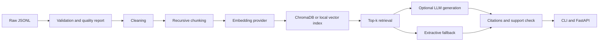

# Final Report: RAG Knowledge Extraction System

## Executive summary

This project implements an end-to-end retrieval-augmented generation system in Python. It supports raw data validation, preprocessing, chunking, embeddings, vector retrieval, optional hosted generation, source citations, conservative unsupported-query handling, corpus analysis, a CLI, and a FastAPI service.

The project is offline-first. The default path uses a local JSONL corpus, deterministic hashed TF-IDF-style vectors, NumPy cosine search, and an extractive answer fallback. Optional Sentence Transformers, ChromaDB, scikit-learn, spaCy, and OpenAI-compatible generation improve capability when installed and configured.

## Architecture



## Evaluation interpretation

Run the following commands to populate the benchmark fields:

```bash
python scripts/evaluate_retrieval.py
python scripts/evaluate_hallucination.py
python scripts/evaluate_system.py
```

The resulting JSON reports should be interpreted together. Retrieval metrics show whether relevant chunks are ranked near the top. Generation quality measures expected-term coverage in the included smoke benchmark. Citation rate and support score measure whether the returned answer is visibly tied to retrieved context. Latency fields help identify whether retrieval, embedding, or external generation is the bottleneck.

| Metric | Artifact | Meaning |
| --- | --- | --- |
| Precision@K | `artifacts/retrieval_evaluation.json` | Fraction of the top K results that are labeled relevant |
| Recall@K | `artifacts/retrieval_evaluation.json` | Fraction of labeled relevant chunks retrieved in the top K |
| Hallucination pass rate | `artifacts/hallucination_evaluation.json` | Grounded cases cited and unsupported cases refused by the guardrail |
| Generation quality | `artifacts/system_evaluation.json` | Expected-term coverage in the 30-case smoke suite |
| Mean support score | `artifacts/system_evaluation.json` | Lexical overlap between answer and retrieved context |
| Latency | `artifacts/system_evaluation.json` | Retrieval, generation, and end-to-end response time |

## Limitations and responsible use

The included demonstration corpus is intentionally small and educational. It should be replaced with a real 5,000+ document dataset for an internship-scale benchmark. The offline generator is extractive and should not be presented as equivalent to a hosted LLM. Lexical overlap is only a heuristic; it can miss valid paraphrases and cannot prove factual correctness. External provider keys should be kept outside source control and injected through environment variables.

## Reproducibility checklist

The repository contains pinned minimum dependency declarations, deterministic local data generation, JSONL intermediate files, JSON reports, unit tests, a demo runbook, and a presentation outline. A new user can reproduce the complete local run without a GitHub account by following `README.md` and `docs/DEMO_GUIDE.md`.
